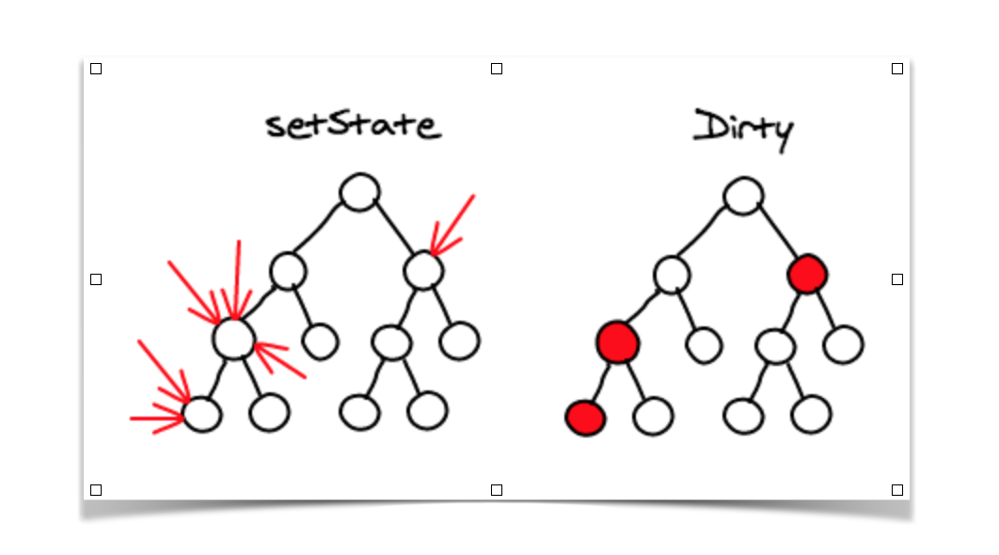
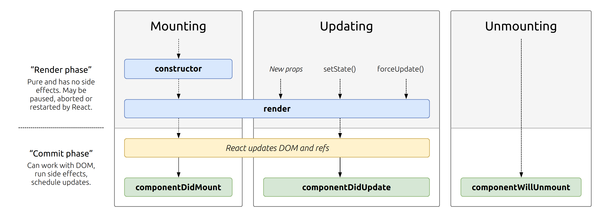

# React

## History

1. Each interaction with a site sends a _request_ to the _server_ => the server sends _JS/HTML/CSS_ back.
   1. **Problem**: make JS work for all browsers.
2. Each interaction with a site sends a _request_ to the _server_ using _jQuery_, which handles different browsers => the server sends _JS/HTML/CSS_ back.
   1. **Problem**: apps became bigger and so the JS files, and so the requests and responses.
3. **Single Page Applications (SPA)** meant the site became an app which didn't need to communicate with the server, but instead the focus was on _JS_ modifying the _HTML/DOM_ (with _AJAX_).
   1. 2010 - **AngularJS** from Google took over. It brought the concept of **components** and patterns such as **MVC**.
   2. **Problem**: Data is now flowing everywhere, the complexity is _huge_. It's hard to code.
   3. 2013 - **React** from Facebook.
   4. 2014 - **AngularJS** moved to **Angular**, so a lot of people moved to React.

## React concepts

1. > Don't touch the DOM. I'll do it for you.
   1. **DOM** = the tree representation of the page.
   2. **Imperative** programming = you change the DOM (e.g. if user is logged in => show this and that and so on)
   3. **Declarative** programming
      1. _React_ will modify the DOM just by showing it a **state**
      2. You tell it **this is the state** and it will _react_ to it.
2. Build websites like lego blocks.
3. Unidirectional data flow.
   1. React takes the _state_ and the _components_ and creates a **VirtualDOM** (can be seen by using [React Developer Tools - React Tab](https://chrome.google.com/webstore/detail/react-developer-tools/fmkadmapgofadopljbjfkapdkoienihi?hl=en)).
   2. **Unidirectional** = if you want to change something, you have to change the _state_ => React _reacts_ to the new state.
      1. Data can **never move up** in the _VirtualDOM_.
      2. Advantage over _AngularJS_.
4. > I'm just the UI. The rest is up to you.
   1. It's a library for the UI, not a framework for _everything_.
   2. You can mix it up with anything.

### State

```javascript
let state = {
  user: "Radu Stochitoiu",
  isLoggedIn: True,
  friends: ["A", "B", "C"],
};
```

### VirtualDOM



## How to be a great React Dev

1. Decide on _components_.
2. Decide the _state_ and _where_ it lives.
3. _What_ changes when state changes.

## NPM vs. YARN

- install dependencies from `package.json`: `npm install` == `yarn`
- install a package and add to `package.json`: `npm install package --save` == `yarn add package`
- install a dev-dependency to `package.json`: `npm install package --save-dev` == `yarn add package --dev`
- remove a dependency from `package.json`: `npm uninstall package --save` == `yarn remove package`
- upgrade a package to its latest version: `npm update --save` == `yarn upgrade`
  - if you want to upgrade to the latest packages, use `^16.13.1` in `package.json` which means any package greater than `16.13.1` will be installed by running `yarn install && yarn upgrade`
- install a package globally: `npm install package -g` == `yarn global add package`

## React Basics

### Set up a project

1. Install [nvm](https://github.com/nvm-sh/nvm).
2. Go on [NodeJS website](https://nodejs.org) and see the latest version.
3. Install the latest version: `nvm install 12.16.2`.
4. Use the latest version: `nvm use 12.16.2`.
5. Create react app: `npx create-react-app <app-name>`.

### Scripts meaning

- **start**: `yarn start` - opens a localhost version of the app.
- **build**: `yarn build` - turn everything in `src/` in something ready for any browser in `build/`. The code is minified and optimized.
- **test**
- **eject**: don't eject!

### Components

- functions don't use inner _states_.
- classes can use inner _states_.
  - you can change state members.
- **JSX** lets us turn `{this.state.something}` into its _HTML value_.
- information is passed by _props_.
- **setState** is _async_, you can't see the results immediately.
  - you can pass a _callback_ as a second parameter to **setState**.
  - you can also pass a **function** instead of an object as the first parameter: `(prevState, prevProps) => ({stateParam: prevState.stateParam + 1})`.
  - it forces an update.
- arrow functions **bind** automatically to the place (context) where they are defined.
  - Rule of thumb: use arrow functions on any class methods you define and **aren't** part of React.

### JSX

- uses specific attributes different from HTML ones:
  - _className_ instead of _class_;
  - _onClick_ instead of _onclick_ etc.
- turns `{something}` into the JS value of `something` in the VirtualDOM.
- every child element needs to have a **key** attribute, so if you change one element, React will render only what you changed, not all the elements.
  - if only one element in a list of 1000 elements changes, it only has to re-render that one.
- attributes:
  - **className**
  - **onChange**
- there are properties called style where we can add CSS:
  - `<div style={{backgroundImage: imageUrl}}></div>`

### Lifecycle methods



- **constructor**.
- **render** - every time the _state_ changes.
- **componentDidMount** - exactly when the component is mounted in the VirtualDOM (at the beginning).
- **componentDidUpdate** - after _setState_ or _new props_ or _forceUpdate_.
- **shouldComponentUpdate** - we decide if the component is rendered again based on _nextProps_ and _nextState_.
  - for example, `return nextProps.attribute1 !== this.props.attribute1`: update the component only if attribute1 changes.
  - good for **performace**!
- **componentWillUnmount** - before a component is destroyed.

### Directory architecture

```
src
└───components
    ├───component1
    |   ├───component1.component.jsx
    |   └───component1.styles.css
    └───component2
        ├───component2.component.jsx
        └───component2.styles.css
```

### Snippets

- `rafc` &rarr; Creates a React Arrow Function Component with ES7 module system.

### Deploying on Github

1. `yarn add gh-pages`
2. In `package.lock` add:
   1. `"homepage": "https://radusqrt.github.io/monsters-rolodex",`
3. In `package.lock`, in **scripts** add:
   1. `"predeploy": "yarn build",`
   2. `"deploy": "gh-pages -d build"`
4. `yarn deploy`

## Routing

### Installation

`yarn add react-router-dom`

### Usage

#### BrowserRouter

In `index.js` import **BrowserRouter**.
Wrap `<App />` around it.

```
import { BrowserRouter } from "react-router-dom";
...
<BrowserRouter>
  <App />
</BrowserRouter>
```

#### Switch

Wrap `<Route>`s around **<Switch></Switch>** to make routing exclusive to your routes instead off concatenating them.

This gives the app the routing functionality.

#### Component router props

In the _props_ object sent to a component there are always some attributes:

- history
- location
  - gives us a full _pathname_ of where we are.
- match
  - in _props.match_ there is an attribute, **isExact**, which is a bool that tells you if the route is exact to the path expected or not.
    - **Example**: `<Route path='/' component={A} />` will be exact for `localhost:5000/` but not exact for `localhost:5000/topics` even if it will still be rendered for the second one.
  - in _props.match_ there is an attribute, **params**, which gives you the dynamically added params to the URL.
    - **Example**: `<Route path='/:topicId' component={A} />` and going to `localhost:5000/13` will give you `params = {topicId: "13"}`.

The _props_ object is given only to the first component that accesses it, not its the children from the VirtualDOM. In order to send them the information, we use **withRouter** to avoid _prop drilling_.

# SASS

It's OOP for CSS.
Extension `.scss`.

## Installation

`yarn add node-sass`

## Examples

```
.menu-item {
   min-width: 30$;

   &.weird {
      height = 1000px;
   }
}
```

```javascript
<div className="weird menu-item"></div>
```

will create a menu-item **which is also weird**.

# Fonts

Take them from [Google Fonts](https://fonts.google.com/).
Get the embedding and add it to `index.html` at the end of `<head>`.

# Glossary

- **HTML** = Hypertext Markup Language
- **DOM** = Document Object Model
- **SPA** = Single Page Application
- **JS** = Javascript
- **CSS** = Cascading Style Sheet
- **MVC** = Model View Controller
- **JSX** = JavaScript XML
- **SASS** = CSS with superpowers
